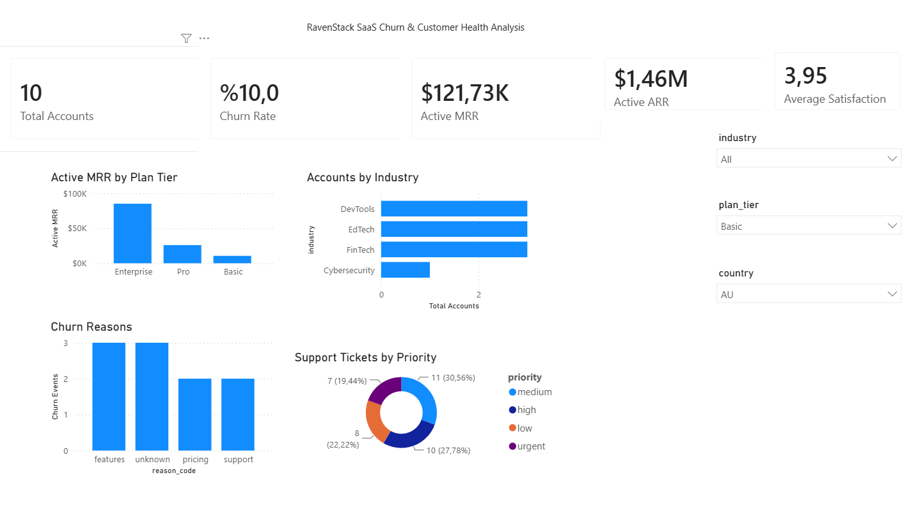
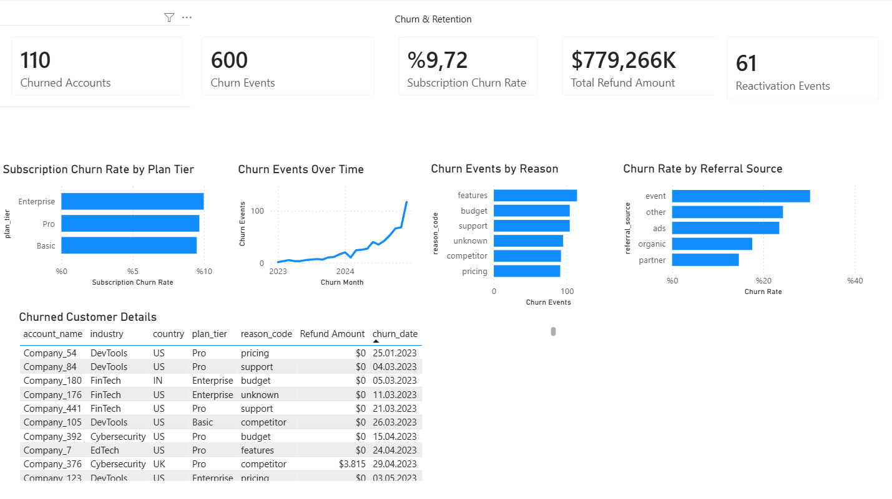
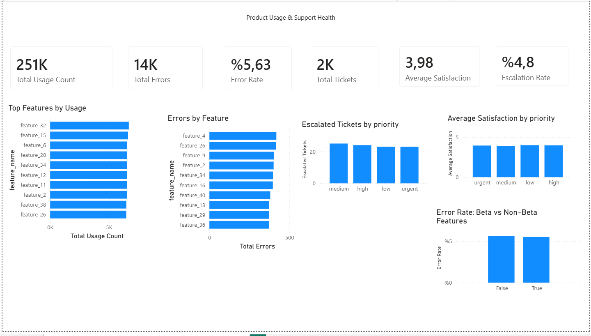

# RavenStack SaaS Churn & Customer Health Analytics

End-to-end SaaS analytics project combining **Python, SQL, SQLite, and Power BI** to analyze customer churn, subscription revenue, product usage, support performance, and customer health.

The project focuses on descriptive and diagnostic analytics rather than predictive churn modeling. During data-quality validation, the dataset showed temporal inconsistencies that make a time-based churn prediction workflow unreliable without further source validation.

## Project Objectives

- Validate core SaaS KPIs across Python, SQL, and Power BI.
- Analyze customer and subscription churn patterns.
- Identify the revenue contribution of each plan tier.
- Evaluate product usage, feature error behavior, and beta-feature performance.
- Assess support health through satisfaction, response, resolution, and escalation metrics.
- Build an exploratory account-level customer health view and test a rule-based risk segmentation.

## Tech Stack

- **Python:** pandas, matplotlib
- **SQL:** SQLite
- **BI:** Power BI
- **Environment:** Jupyter Notebook / VS Code

## Data Source

This project uses the **SaaS Subscription & Churn Analytics Dataset**
created by **River | Datasets for SQL Practice** and published on Kaggle.

- **Dataset:** SaaS Subscription & Churn Analytics Dataset
- **Source:** [Kaggle](https://www.kaggle.com/datasets/rivalytics/saas-subscription-and-churn-analytics-dataset)
- **License:** MIT
- **Data type:** Synthetic multi-table SaaS dataset

RavenStack is a fictional SaaS platform created for practicing SQL,
business intelligence, data analysis, and data science workflows.

The original dataset was used as the foundation for this project.
All data quality checks, exploratory analysis, SQL queries, derived KPIs,
customer health segmentation, and Power BI dashboards in this repository
were developed independently as part of this portfolio project.

> The MIT License in this repository applies to the project code and analysis.
> The original dataset remains subject to the terms and license of its source.


## Dataset

The analysis uses five related SaaS tables:

| Table | Rows | Purpose |
|---|---:|---|
| `accounts` | 500 | Customer profile, acquisition source, plan, and churn status |
| `subscriptions` | 5,000 | Subscription lifecycle, plan, MRR/ARR, and churn status |
| `feature_usage` | 25,000 | Feature usage, duration, errors, and beta-feature status |
| `support_tickets` | 2,000 | Support priority, response/resolution time, satisfaction, and escalation |
| `churn_events` | 600 | Churn reason, refund, reactivation, and preceding account events |

## Data Quality Checks

The notebook includes missing-value, relationship, duplicate, and temporal consistency checks.

Key findings from validation:

- No broken account/subscription relationships were found.
- No exact duplicate feature-usage rows were found.
- `21` source `usage_id` values were reused across different events, so a surrogate `usage_record_id` was created instead of deleting valid records.
- Temporal checks identified:
  - `13,198` usage records before account signup.
  - `19,142` usage records before subscription start.
  - `290` usage records after subscription end.
  - `1,077` support tickets before account signup.

These records are retained and documented as dataset limitations. In a production environment, they would require validation against source systems before predictive modeling.

## Core KPIs

| KPI | Result |
|---|---:|
| Total Accounts | 500 |
| Churned Accounts | 110 |
| Account Churn Rate | 22.00% |
| Active MRR | $10,159,608 |
| Active ARR | $121,915,296 |
| Support Tickets | 2,000 |
| Average Satisfaction | 3.98 / 5 |
| Product Error Rate | 5.63% |
| Escalation Rate | 4.75% |

## Key Insights

**Churn.** Feature-related churn is the most frequent churn reason. Event-sourced accounts have the highest account churn rate at approximately `30.21%`, while partner-sourced accounts have the lowest at approximately `14.61%`. Subscription churn rates are close across plan tiers, with Enterprise slightly highest at approximately `9.98%`.

**Revenue.** Enterprise is the dominant segment, contributing approximately `74.28%` of active MRR. This makes Enterprise retention especially important from a revenue perspective.

**Product usage.** Usage is spread across several high-activity features. Among the most-used features, `feature_26`, `feature_2`, and `feature_34` show relatively high error rates. Beta and non-beta features have very similar error rates (`5.53%` vs. `5.64%`), suggesting beta status alone does not explain product errors.

**Support health.** Average satisfaction is close to `4/5`, and only `4.75%` of tickets are escalated. Support metrics alone do not clearly distinguish churned from active accounts in this dataset.

**Customer health.** The exploratory rule-based risk score does not produce a monotonic relationship with churn: Medium Risk has the highest churn rate, while High Risk does not. The score is therefore treated as a descriptive segmentation exercise, not as a predictive churn model.

## Power BI Dashboard

The Power BI report contains three pages:

1. **Executive Overview** — headline KPIs, active MRR by plan tier, accounts by industry, churn reasons, support-ticket distribution, and slicers.
2. **Churn & Retention** — churned accounts, churn events, subscription churn rate, refunds, reactivations, churn trends, referral-source analysis, and customer detail.
3. **Product Usage & Support Health** — usage, errors, error rate, support KPIs, top features, feature errors, satisfaction/escalation views, and beta vs. non-beta error rates.

Power BI file: [`powerbi/ravenstack_saas_churn_dashboard.pbix`](powerbi/ravenstack_saas_churn_dashboard.pbix)

### Executive Overview



### Churn & Retention




### Product Usage & Support Health




## SQL Analysis

`sql/analysis_queries.sql` contains 13 analysis queries covering:

- Account-level churn rate
- Active MRR and ARR
- Churn reasons and refunds
- Churn by referral source
- Subscription churn by plan tier
- Monthly churn events
- Revenue and active MRR share by plan tier
- Feature usage and error analysis
- Beta vs. non-beta error rates
- Support health by priority
- Account-level customer health view

A ready-to-query SQLite database is included at `sql/ravenstack.db`.


## Repository Structure

```text
ravenstack-saas-churn-analytics/
├── README.md
├── data/
│   ├── ravenstack_accounts.csv
│   ├── ravenstack_churn_events.csv
│   ├── ravenstack_feature_usage.csv
│   ├── ravenstack_subscriptions.csv
│   └── ravenstack_support_tickets.csv
├── notebooks/
│   └── ravenstack_saas_churn_analysis.ipynb
├── sql/
│   ├── analysis_queries.sql
│   └── ravenstack.db
├── powerbi/
│   └── ravenstack_saas_churn_dashboard.pbix
└── assets/
  ├── executive_overview.png
  ├── churn_retention.png
  └── product_usage_support_health.png
```

## How to Run

### Python analysis

```bash
git clone <your-repository-url>
cd ravenstack-saas-churn-analytics
pip install -r requirements.txt
cd notebooks
jupyter notebook ravenstack_saas_churn_analysis.ipynb
```

The notebook reads the CSV files from `../data/` and exports the SQLite database to `../sql/ravenstack.db`.

### SQL

Using the SQLite CLI:

```bash
sqlite3 sql/ravenstack.db < sql/analysis_queries.sql
```

You can also open `sql/ravenstack.db` with a SQLite extension in VS Code or another database client.

### Power BI

Open `powerbi/ravenstack_saas_churn_dashboard.pbix` in Power BI Desktop.

## Limitations

- The dataset contains documented temporal inconsistencies across account, subscription, usage, and support records.
- The rule-based risk score is exploratory and should not be interpreted as a validated predictive churn model.
- The current project intentionally prioritizes analytics, SQL, BI, and business interpretation over machine-learning modeling.

## Future Work

A separate data-science project can extend the portfolio with a dataset designed for predictive modeling, including a reliable observation window, leakage-safe feature engineering, model validation, explainability, and deployment-oriented evaluation.
